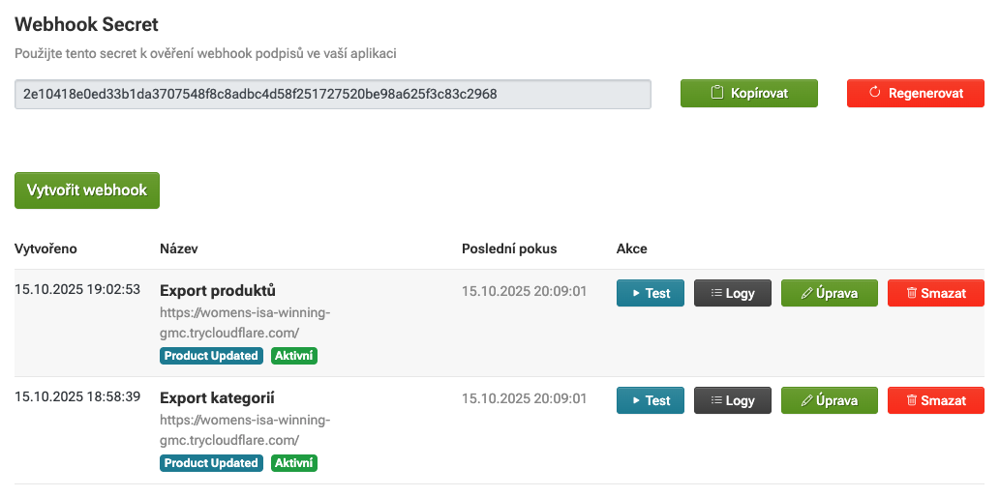
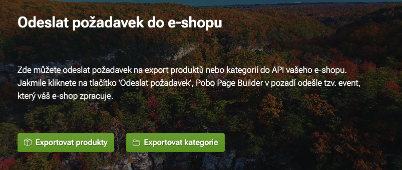

# Návod na zpracování webhooků (PHP)

Tento návod vysvětluje, jak přijímat a ověřovat webhooky z naší platformy.

---

## Co je webhook?

Webhook je HTTP POST notifikace, kterou vám pošleme, když dojde k události (např. aktualizace produktů nebo kategorií).
Webhook **neobsahuje data**, pouze vás informuje, že se něco změnilo.

---

## Rychlý start

1. Spusťte `make build` pro sestavení a spuštění Docker image
2. Spusťte `make proxy` pro vytvoření veřejné URL pomocí [Cloudflare Tunnel](https://developers.cloudflare.com/cloudflare-one/connections/connect-apps/run-tunnel/trycloudflare/)
3. Přihlaste se do [administrace](http://client.pobo.space)
4. Jděte do [Nastavení → Webhook API](http://client.pobo.space/merchant/setting/webhook)
5. Klikněte **Regenerovat**
6. Nastavte nový webhook:
    - **URL**: `https://xxx.xxx.xxx.trycloudflare.com` (pro otestování) nebo `https://vase-domena.cz/webhook.php` (pro produkci)
    - **Event zvolte**: `Products.update` nebo `Categories.update`
7. Zkopírujte **Webhook Secret** a vložte jej proměnné `$webhookSecret` v kódu `src/index.php`.
8. Klikněte na **Test webhook** u daného webhooku
9. Zkontrolujte `logs/webhook.log` - měli byste vidět přijatý webhook (případně `make tail` pro sledování v reálném čase)



---

## Struktura webhooku

### HTTP Request
```http
POST /webhook.php HTTP/1.1
Host: vase-domena.cz
Content-Type: application/json
X-Webhook-Signature: a3f2b1c8d9e7f6a5b4c3d2e1f0a9b8c7d6e5f4a3b2c1d0e9f8a7b6c5d4e3f2a1
X-Webhook-Event: Products.update
```

### JSON Payload
```json
{
  "event": "Products.update",
  "timestamp": "2025-10-15T14:30:00Z",
  "eshop_id": 123
}
```

### Pole

| Pole | Typ | Popis |
|------|-----|-------|
| `event` | string | Typ události (`Products.update`, `Categories.update`) |
| `timestamp` | string (ISO 8601) | Čas kdy událost nastala |
| `eshop_id` | integer | ID vašeho e-shopu |

---

## Ověření podpisu (DŮLEŽITÉ!)

Webhook **MUSÍTE** ověřit pomocí HMAC podpisu, aby nikdo nemohl podvrhnout falešné webhooky.

### Jak to funguje?

1. My vytvoříme HMAC-SHA256 podpis z payloadu pomocí vašeho **webhook secret**
2. Tento podpis pošleme v hlavičce `X-Webhook-Signature`
3. Vy vypočítáte stejný podpis a porovnáte

### Implementace
```php
<?php

// Váš webhook secret (zkopírujte z administrace)
define('WEBHOOK_SECRET', 'zde_vložte_váš_secret_z_administrace');

// Získej raw payload (PŘED parse JSON!)
$payload = file_get_contents('php://input');

// Získej podpis z hlavičky
$receivedSignature = $_SERVER['HTTP_X_WEBHOOK_SIGNATURE'] ?? '';

// Vypočítej očekávaný podpis
$calculatedSignature = hash_hmac('sha256', $payload, WEBHOOK_SECRET);

// Porovnej podpisy (VŽDY použij hash_equals!)
if (!hash_equals($calculatedSignature, $receivedSignature)) {
    // Neplatný podpis = falešný webhook
    http_response_code(401);
    die('Invalid signature');
}

// Podpis je OK, můžete pokračovat
$data = json_decode($payload, true);
```

**⚠️ DŮLEŽITÉ:**
- Použijte `hash_equals()` místo `==` (ochrana proti timing attacks)
- Počítejte podpis z **raw payloadu**, ne z parsovaného JSON
- Secret uchovávejte v tajnosti (mimo Git)

---

## Kompletní příklad
```php
<?php
// webhook.php

// ========================================
// KONFIGURACE
// ========================================

define('WEBHOOK_SECRET', 'zde_vložte_váš_secret_z_administrace');

// ========================================
// FUNKCE
// ========================================

/**
 * Ověří HMAC podpis webhooku
 */
function verifyWebhookSignature($payload, $signature, $secret) {
    $calculatedSignature = hash_hmac('sha256', $payload, $secret);
    return hash_equals($calculatedSignature, $signature);
}

/**
 * Loguje zprávy do souboru
 */
function logWebhook($message) {
    $timestamp = date('Y-m-d H:i:s');
    file_put_contents('webhook.log', "[$timestamp] $message\n", FILE_APPEND);
}

// ========================================
// HLAVNÍ KÓD
// ========================================

try {
    // 1. Získej raw payload a podpis
    $payload = file_get_contents('php://input');
    $signature = $_SERVER['HTTP_X_WEBHOOK_SIGNATURE'] ?? '';
    
    logWebhook("Webhook received");
    
    // 2. Ověř podpis
    if (!verifyWebhookSignature($payload, $signature, WEBHOOK_SECRET)) {
        http_response_code(401);
        logWebhook("ERROR: Invalid signature");
        die('Invalid signature');
    }
    
    logWebhook("Signature verified");
    
    // 3. Parsuj JSON
    $data = json_decode($payload, true);
    
    if (!$data) {
        http_response_code(400);
        logWebhook("ERROR: Invalid JSON");
        die('Invalid JSON');
    }
    
    $event = $data['event'];
    $eshopId = $data['eshop_id'];
    $timestamp = $data['timestamp'];
    
    logWebhook("Event: $event, Eshop: $eshopId");
    
    // 4. Okamžitě odpověz (do 10 sekund!)
    http_response_code(200);
    echo 'OK';
    
    // Zavři spojení s klientem
    if (function_exists('fastcgi_finish_request')) {
        fastcgi_finish_request();
    }
    
    // 5. Zpracuj webhook podle typu
    switch ($event) {
        case 'Products.update':
            logWebhook("Processing product update");
            // Zde zpracujte aktualizaci produktů
            break;
            
        case 'Categories.update':
            logWebhook("Processing category update");
            // Zde zpracujte aktualizaci kategorií
            break;
            
        default:
            logWebhook("Unknown event: $event");
    }
    
    logWebhook("Webhook processed successfully");
    
} catch (Exception $e) {
    logWebhook("ERROR: " . $e->getMessage());
    http_response_code(500);
}
```

---

## Důležité poznámky

### ✅ Vždy odpovězte rychle (do 10 sekund)

Webhook **MUSÍ** dostat odpověď 200 do 10 sekund, jinak se bude opakovat.
```php
// SPRÁVNĚ
http_response_code(200);
echo 'OK';

// Nyní můžete dlouho zpracovávat
processData(); // Může trvat i minuty
```

### ✅ Uchovávejte secret v tajnosti
```php
// ŠPATNĚ - secret přímo v kódu
define('WEBHOOK_SECRET', 'abc123...');

// SPRÁVNĚ - secret v config souboru
$config = include '/etc/webhook-config.php';
define('WEBHOOK_SECRET', $config['secret']);

// NEBO v environment proměnné
define('WEBHOOK_SECRET', getenv('WEBHOOK_SECRET'));
```

### ✅ Logujte všechny pokusy

Pro debugging doporučujeme logovat všechny příchozí webhooky:
```php
function logWebhook($message) {
    $timestamp = date('Y-m-d H:i:s');
    file_put_contents('webhook.log', "[$timestamp] $message\n", FILE_APPEND);
}
```

---

## Testování

### 1. Test z administrace

V administraci klikněte na **Test webhook** - měli byste vidět v `webhook.log`:
```
[2025-10-15 14:30:00] Webhook received
[2025-10-15 14:30:00] Signature verified
[2025-10-15 14:30:00] Event: Products.update, Eshop: 123
[2025-10-15 14:30:00] Webhook processed successfully
```

### 2. Manuální test pomocí cURL
```bash
# Vygenerujte test podpis
SECRET="váš_secret"
PAYLOAD='{"event":"Products.update","timestamp":"2025-10-15T14:30:00Z","eshop_id":123}'
SIGNATURE=$(echo -n "$PAYLOAD" | openssl dgst -sha256 -hmac "$SECRET" | cut -d' ' -f2)

# Pošlete test webhook
curl -X POST https://vase-domena.cz/webhook.php \
  -H "Content-Type: application/json" \
  -H "X-Webhook-Signature: $SIGNATURE" \
  -H "X-Webhook-Event: Products.update" \
  -d "$PAYLOAD"
```

---

## Možné chyby

### `401 Invalid signature`

**Příčina:** Nesprávný webhook secret nebo chyba ve výpočtu podpisu

**Řešení:**
- Zkontrolujte, že máte správný secret z administrace
- Ujistěte se, že počítáte podpis z raw payloadu (před `json_decode`)
- Použijte `hash_equals()` pro porovnání

### `Timeout`

**Příčina:** Váš endpoint neodpověděl do 10 sekund

**Řešení:**
```php
// Odpovězte OKAMŽITĚ
http_response_code(200);
echo 'OK';
fastcgi_finish_request();

// Teprve pak zpracovávejte
heavyProcessing();
```

---

## Podporované události

| Event | Kdy se vyvolá                               |
|-------|---------------------------------------------|
| `Products.update` | Když uživatel klikne "Exportovat produkty"  |
| `Categories.update` | Když uživatel klikne "Exportovat kategorie" |


---

## Podpora

Potřebujete pomoc? Kontaktujte nás:

- **Email:** tomas@pobo.cz
- **Dokumentace k REST API:** https://docs.pobo.space

---

**Hotovo!** Nyní byste měli úspěšně přijímat a ověřovat webhooky. 🎉